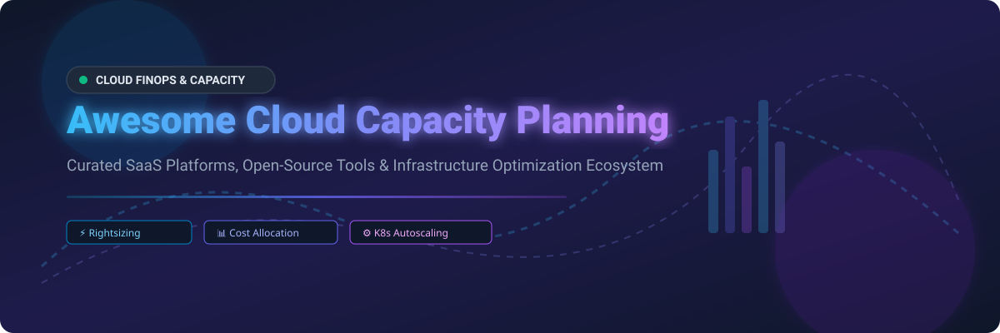

  
  
  
  
  
  

  

# ☁️ Awesome Cloud Capacity Planning & FinOps Ecosystem 🚀

**A curated list of enterprise SaaS platforms, open-source tools, and resources for Cloud Resource Optimization, Rightsizing, Cost Allocation, Autoscaling Intelligence, and Workload Efficiency.**

---

## 💡 Overview & Market Landscape

The global **Cloud Financial Management (FinOps) and Capacity Optimization market** is estimated at **$10.5 Billion to $12.8 Billion**, experiencing a ~22% CAGR driven by multi-cloud enterprise adoption, Kubernetes scaling complexity, and AI infrastructure costs. 

The sector is **moderately fragmented**: 
- **Consolidation & M&A** at the enterprise tier (e.g., IBM acquiring Apptio & Turbonomic, Thoma Bravo/Flexera acquiring CloudCheckr) creates dominant suite vendors.
- **Specialized Innovators** (e.g., ScaleOps, Infracost) rapidly capture niche market share in autonomous Kubernetes scaling and Developer FinOps.

---

## 📌 Table of Contents
- [🏢 Enterprise SaaS & Hosted Platforms](#-enterprise-saas--hosted-platforms)
- [🔓 Open-Source GitHub Projects](#-open-source-github-projects)
- [🤝 Support & Community](#-support--community)
- [🤝 How to Contribute](#-how-to-contribute)
- [📈 Star History](#-star-history)
- [⚠️ Disclaimer](#%EF%B8%8F-disclaimer)

---

## 🏢 Enterprise SaaS & Hosted Platforms

> [!NOTE]
> Below are top SaaS offerings ranked by company valuation / revenue scale (descending).

| Platform | Description | Size (Valuation / Revenue) | Pricing Details | Free Tier / Trial Limits |
| :--- | :--- | :--- | :--- | :--- |
| 🔹 **[Apptio Cloudability](https://www.apptio.com/products/cloudability/)** | Enterprise multi-cloud cost allocation, rightsizing, showback, and FinOps governance platform. | **$4.6B Valuation** *(Acquired by IBM; ~$300M ARR)* | Custom contract; based on cloud spend volume (starts ~$500/mo for entry tiers). | 14-day to 28-day free trial (available via AWS Marketplace). |
| 🔹 **[Flexera One](https://www.flexera.com/)** | Comprehensive IT asset management & multi-cloud hybrid capacity planning solution. | **$2.9B Valuation** *(Thoma Bravo PE deal; ~$250M-$500M Revenue)* | Custom enterprise annual quote based on managed environment size. | 30-day proof-of-concept / guided evaluation. |
| 🔹 **[IBM Turbonomic](https://www.ibm.com/products/turbonomic)** | Application Resource Management (ARM) continuously matching compute/storage demand to capacity. | **$1.5B–$2.0B Valuation** *(Acquired by IBM)* | Custom per-Managed Virtual Server (MVS) license contract. | 30-day free trial on full platform. |
| 🔹 **[ScaleOps](https://scaleops.com/)** | Autonomous cloud & AI infrastructure platform for Kubernetes pod/node rightsizing & bin-packing. | **$800M+ Valuation** *(Series C funded, $210M total raised)* | Custom enterprise quota based on cluster compute capacity. | 7-day automated free trial. |
| 🔹 **[CloudHealth by VMware](https://cloud.vmware.com/)** | Multi-cloud cost governance, rightsizing recommendations, and showback reporting. | **$500M+ Valuation** *(Acquired by VMware / Broadcom Tanzu; $50M ARR)* | Custom contract based on % of monthly cloud spend (typically 2%-3%). | Guided demo & partner-managed evaluation access. |
| 🔹 **[CloudCheckr](https://cloudcheckr.com/)** | Total visibility platform for cloud cost optimization, inventory, and governance. | **$100M Valuation** *(Acquired by Flexera; ~$29M Revenue)* | Custom annual agreements (typically starting ~$50,000/yr for enterprise). | 14-day free trial via sales request. |
| 🔹 **[CloudBolt](https://www.cloudbolt.io/)** | Hybrid cloud management platform with self-service provisioning, cost tracking, and capacity orchestration. | **$71.6M Funding** *(~$20M-$33M estimated ARR)* | Free tier available; paid tier custom per-managed VM subscription. | **Free Forever** for up to **100 managed resources** (VMs, DBs, clusters). |
| 🔹 **[Densify](https://www.densify.com/)** | Machine-learning capacity engine for automated container & VM workload optimization. | **~$30M Revenue** *(Private entity)* | Custom quote based on infrastructure node/VM count. | 14-day to 30-day free trial option. |
| 🔹 **[StormForge](https://www.stormforge.io/)** | Machine learning Kubernetes proactive rightsizing & auto-tuning platform. | **Private Enterprise** *(Acquired by CloudBolt)* | Enterprise custom subscription or AWS Marketplace meter. | 30-day free trial for Optimize Live. |
| 🔹 **[ParkMyCloud](https://www.ibm.com/)** | Automated resource parking/scheduling engine to turn off non-production cloud instances. | **Acquired Portfolio** *(Part of IBM / Turbonomic portfolio)* | Starts at $3 per managed instance / month. | **Free Tier** for up to 5 resources or 14-day free trial. |

---

## 🔓 Open-Source GitHub Projects

> [!TIP]
> Popular open-source frameworks for Kubernetes capacity planning, cost estimation, and autoscaling. Ranked by GitHub_Stars_Count (descending).

- ⚡ **[Kubernetes Core](https://github.com/kubernetes/kubernetes)**  
    
  Production-grade container orchestration system powering containerized infrastructure capacity & native scheduling.

- ⚡ **[Prometheus Stack](https://github.com/prometheus/prometheus)**  
    
  CNCF open observability & monitoring toolkit for utilization metrics, capacity trends, and alerts.

- ⚡ **[Infracost](https://github.com/infracost/infracost)**  
    
  Cloud cost estimates for Terraform in pull requests—shifting capacity cost awareness left to developers.

- ⚡ **[KEDA (Kubernetes Event-driven Autoscaling)](https://github.com/kedacore/keda)**  
    
  CNCF event-driven autoscaler for Kubernetes to scale workloads based on external queue depths & custom metrics.

- ⚡ **[Kubernetes Autoscaler (HPA / VPA / Cluster Autoscaler)](https://github.com/kubernetes/autoscaler)**  
    
  Official Kubernetes autoscaling tools for Horizontal Pod Autoscaling, Vertical Pod Autoscaling, and node-level Cluster Autoscaling.

- ⚡ **[Karpenter (AWS Provider)](https://github.com/aws/karpenter-provider-aws)**  
    
  High-performance, flexible Kubernetes node autoscaler that rapidly provisions optimal EC2 instances based on unschedulable pod requirements.

- ⚡ **[OpenCost](https://github.com/opencost/opencost)**  
    
  CNCF open-source cost monitoring and real-time allocation engine for Kubernetes and multi-cloud environments.

- ⚡ **[ec2instances.info (Vantage)](https://github.com/vantage-sh/ec2instances.info)**  
    
  Open data aggregator comparing AWS EC2 instance specs, memory, throughput, and pricing for capacity selection.

- ⚡ **[Grafana Mimir](https://github.com/grafana/mimir)**  
    
  Open-source, massively scalable time-series backend for long-term capacity metrics storage.

- ⚡ **[Goldilocks](https://github.com/FairwindsOps/goldilocks)**  
    
  Open-source utility that leverages VPA recommendations to identify baseline resource request recommendations for Kubernetes namespaces.

- ⚡ **[Karpenter Core (Kubernetes SIGs)](https://github.com/kubernetes-sigs/karpenter)**  
    
  Vendor-agnostic core for Karpenter cluster autoscaling and compute bin-packing.

---

## 🤝 Support & Community

If you find this repository helpful, please consider supporting the project! 💖

- ⭐ **Star** this repository on GitHub to show your appreciation.
- 🔀 **Fork** and share with your team, platform engineering groups, and FinOps practitioners.
- ☕ **Buy Me a Coffee**: Support ongoing open-source maintenance via [GitHub Sponsors Dashboard](https://github.com/sponsors/ishandutta2007).

---

## 🤝 How to Contribute

1. Fork this repository.
2. Create a new feature branch (`git checkout -b feature/new-tool`).
3. Add your tool to `README.md` following the tabular / badge format.
4. Submit a Pull Request with a brief explanation of the tool.

---

## 📈 Star History

---

## ⚠️ Disclaimer

This is a **community-curated** awesome list. Product details, valuations, and pricing tiers change frequently over time. Always verify specifications directly with official vendor websites before making architectural or purchasing decisions.

---

**Made with ❤️ for FinOps practitioners, platform engineers, and open-source cloud architects.**
